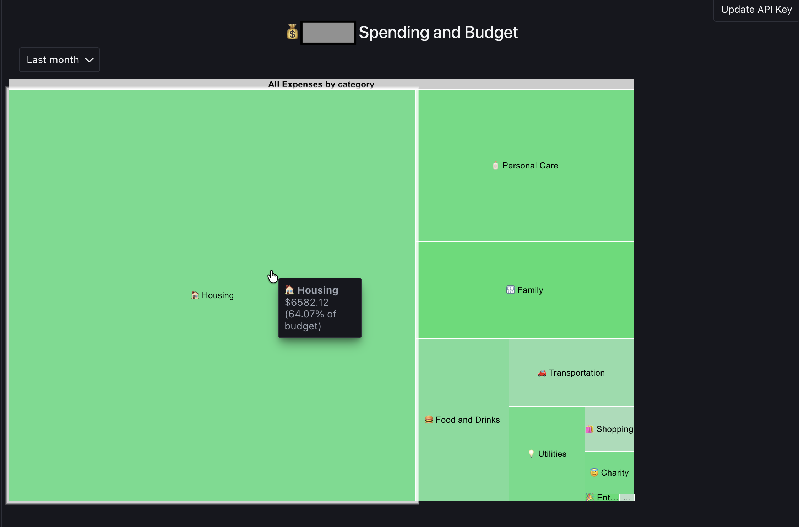

# Lunch Bites

[Lunch Money](https://lunchmoney.app/) is a personal finance and budgeting website which organizes expenses into hierarchical [categories](https://lunchmoney.app/features/categories-tags) and associates [budgets](https://lunchmoney.app/features/budgeting/) with them. These are experimental utilities using the [Lunch Money API](https://lunchmoney.dev/v2/docs). 

## Tree map of expenses

A [Tree map](https://en.wikipedia.org/wiki/Treemapping) helps to visualize the amount spent in each category as rectangles whose areas are in proportion to the total. It has the following features:

- color of a rectangle is based on the portion of the budget spent in that category,
- drill down and roll up the category hierarchy,
- show the transactions that went into each category or its sub-categories

This can be viewed for the current and last month.

## Getting started

[Install Node.js](https://nodejs.org/en/download) and clone this repo. Then run locally using `npm run dev`. A [Lunch Money access token](https://my.lunchmoney.app/developers) is required. The access token remans local to the browser and does not go back to the server.

That's it for now! Stay tuned for other utilities.
